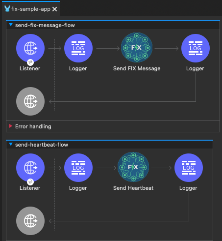

# FIX Protocol Connector Project



Complete MuleSoft connector implementation for the Financial Information eXchange (FIX) Protocol, built for Mule runtime 4.9+ and Java 17.

## Project Structure

```
fix-connector/
├── mulesoft-fix-connector/           # FIX Protocol Connector
│   ├── src/main/java/
│   │   └── org/mule/extension/fix/
│   │       ├── api/                  # Public API (FIXMessage, Parser, Builder)
│   │       └── internal/             # Internal implementation
│   ├── CONNECTOR_README.md           # Detailed connector documentation
│   ├── pom.xml
│   └── target/
│       └── mulesoft-fix-connector-1.0.0.jar
│
├── fix-sample-app/                   # Sample MuleSoft application
│   ├── src/main/mule/
│   │   └── fix-sample-app.xml        # Sample flows
│   ├── README.md                      # Usage examples
│   └── pom.xml
│
└── fix-server-go/                    # Test FIX Server (Go/Python)
    ├── main.go                        # Go implementation
    ├── fix_server.py                  # Python implementation
    └── README.md                      # Server documentation
```

## Quick Start

### Prerequisites

- **Java 17** installed and configured as JAVA_HOME
- **Apache Maven 3.6+** installed
- **Anypoint Studio 7.12+** (or latest)
- **Python 3.7+** (for test FIX server)

### Step 0: Start the Test FIX Server

Before running the sample application, start the test FIX server:

```bash
cd fix-server-go
python3 fix_server.py
```

The server will start on **localhost:9876** and display:
```
FIX Server started on localhost:9876
Waiting for connections...
```

Leave this terminal running. See `fix-server-go/README.md` for details.

### Step 1: Build and Install the Connector Locally

The connector must be built and installed to your local Maven repository before it can be used in the sample application.

```bash
cd mulesoft-fix-connector
mvn clean install
```

This will:
1. Compile the connector source code
2. Generate the connector's XML schema (XSD)
3. Package the connector as a JAR file
4. Install it to `~/.m2/repository/org/mule/extension/mulesoft-fix-connector/1.0.0/`

**Expected output:**
```
[INFO] BUILD SUCCESS
[INFO] Installing .../mulesoft-fix-connector-1.0.0.jar to ~/.m2/repository/...
```

**Note:** After making changes to the connector code, you must run `mvn clean install` again and restart Anypoint Studio for changes to take effect.

### Step 2: Import the Sample Application into Anypoint Studio

1. **Open Anypoint Studio**

2. **Import the Project:**
   - Go to **File** > **Import...**
   - Select **Anypoint Studio** > **Packaged mule application (.jar)**
   - Click **Next**

3. **Select the Project:**
   - Click **Browse** and navigate to: `/Users/alex.macdonald/fix-connector/fix-sample-app`
   - Select the `fix-sample-app` folder
   - Click **Open**, then **Finish**

4. **Wait for Dependencies to Download:**
   - Studio will automatically download all dependencies from Maven Central and your local repository
   - This may take 2-5 minutes on first import
   - Watch the progress in the bottom-right corner

5. **Verify the Connector is Loaded:**
   - Open the **Mule Palette** (right side of Studio)
   - Search for "FIX"
   - You should see the **FIX Connector** with operations like:
     - Send Message
     - Send Heartbeat
     - Send Logout
     - Get Session Info
     - Request Resend

**Troubleshooting Import Issues:**
- If the connector doesn't appear, go to **Project** > **Clean...** and clean the project
- If you see XSD validation errors, restart Anypoint Studio
- If dependencies fail to download, check your internet connection and Maven settings

### Step 3: Run the Sample Application in Anypoint Studio

1. **Open the Mule Configuration:**
   - In the **Package Explorer**, expand `fix-sample-app` > `src/main/mule`
   - Double-click `fix-sample-app.xml`

2. **Verify the Configuration:**
   - In the canvas view, click the **Global Elements** tab at the bottom
   - You should see:
     - `HTTP_Listener_config` (port 8081)
     - `FIX_Config` (host: localhost, port: 9876)

3. **Start the Application:**
   - Right-click on the project `fix-sample-app` in the Package Explorer
   - Select **Run As** > **Mule Application**

4. **Monitor the Console:**
   - Watch the **Console** tab at the bottom
   - You should see logs indicating:
     ```
     INFO  FIXConnectionProvider - Connecting to FIX server at localhost:9876
     INFO  FIXSessionManager - Sending Logon message
     INFO  FIXSessionManager - Received Logon response - session established
     INFO  Application started successfully
     ```

5. **Verify the Connection:**
   - The FIX server terminal should show:
     ```
     New connection from ('127.0.0.1', XXXXX)
     Received Logon from CLIENT1 to SERVER1
     Sent Logon response
     ```

**Troubleshooting Run Issues:**
- **Connection timeout:** Ensure the FIX server is running on port 9876
- **Port 8081 already in use:** Change the HTTP port in `fix-sample-app.xml`
- **ClassNotFoundException:** Rebuild the connector with `mvn clean install`

### Step 4: Test the Connector

Once the application is running, test it using **curl** or **Postman**.

#### Quick Test with curl

```bash
# Get session info
curl http://localhost:8081/fix/session

# Send a heartbeat
curl -X POST http://localhost:8081/fix/heartbeat \
  -H "Content-Type: application/json" \
  -d '{}'

# Send new order
curl -X POST http://localhost:8081/fix/order/new \
  -H "Content-Type: application/json" \
  -d '{
    "clOrdID": "ORD-001",
    "side": "1",
    "symbol": "EUR/USD",
    "orderQty": "1000000",
    "price": "1.1850"
  }'
```

#### Comprehensive Testing with Postman

For a complete test suite with all connector operations, use the included Postman collection:

1. Import `FIX_Connector_Tests.postman_collection.json` into Postman
2. Run tests in this order:
   - **Get Session Info** (verify connection)
   - **Send Heartbeat**
   - **Send New Order (Single)**
   - **Send Custom FIX Message (NewOrderSingle)**
   - **Send Custom Message (All Tags)**
   - **Request Resend**
   - **Send Logout**

See `POSTMAN_TESTING_GUIDE.md` for detailed instructions and expected responses.

## Features

### ✅ FIX Protocol Implementation

- **Session Layer:** Stateful conversation management with automatic logon/logout
- **Sequence Tracking:** Validates incoming/outgoing message sequences with gap detection
- **Heartbeat Mechanism:** Automatic heartbeat generation and test request handling
- **Message Validation:** Checksum validation and required field verification
- **Connection Recovery:** Handles resend requests, sequence resets, and reconnection

### ✅ MuleSoft Integration

- **Operations:** Send messages, heartbeats, test requests, resend requests
- **Source (Listener):** Receive and process incoming FIX messages
- **Configuration:** Flexible connection and session parameters
- **Error Handling:** Graceful degradation and error reporting

### ✅ Production-Ready Features

- **Object Store Integration:** Session state persistence (in-memory with extensibility)
- **Logging:** Comprehensive SLF4J logging at all levels
- **Thread Safety:** Concurrent message handling with proper synchronization
- **Resource Management:** Clean connection lifecycle management

## Technical Specifications

### Requirements

- **Java:** 17
- **MuleSoft Runtime:** 4.4.0+
- **Maven:** 3.6+
- **FIX Server:** Any FIX-compliant server (FIX.4.2, FIX.4.4, FIXT.1.1)

### Connector Components

#### API Layer (`org.mule.extension.fix.api`)

- **`FIXMessage`**: Message model with field management and checksum calculation
- **`FIXMessageParser`**: Parses raw FIX strings with validation
- **`FIXMessageBuilder`**: Fluent API for message construction
- **`FIXParseException`**: Parse error handling

#### Internal Layer (`org.mule.extension.fix.internal`)

- **`FIXExtension`**: Main extension class
- **`FIXConfiguration`**: Connector configuration parameters
- **`FIXConnectionProvider`**: Manages connection lifecycle
- **`FIXConnection`**: Wraps session manager for operations
- **`FIXSessionManager`**: Core protocol logic and state machine
- **`FIXSessionState`**: Session state with sequence tracking
- **`FIXSessionStateManager`**: State persistence manager
- **`FIXOperations`**: Connector operations (send, heartbeat, etc.)
- **`FIXMessageListener`**: Source for incoming messages

### Architecture Highlights

#### 1. Session Management Service

Dedicated flow managing the Object Store state for sequence numbers and session status.

```java
FIXSessionStateManager
├── Session State Storage (concurrent HashMap)
├── Sequence Validation
└── State Persistence
```

#### 2. Message Processing Pipeline

Handles incoming FIX messages with sequence validation:

```java
processIncomingMessage()
├── Parse Message
├── Validate Checksum
├── Validate Sequence Number
│   ├── If Gap: Send ResendRequest + Buffer Message
│   ├── If Lower: Check PossDupFlag
│   └── If Valid: Process Message
└── Route by Message Type
```

#### 3. Heartbeat Service

Separate scheduler-driven flow for maintenance:

```java
heartbeatScheduler (every 5 seconds)
├── Check if heartbeat needed (no message sent in interval)
├── Check if test request needed (no message received in 1.2x interval)
└── Check if connection dead (no message in 2x interval)
```

#### 4. Connection Monitor

Tracks connection health and triggers reconnection logic:

```java
isConnectionDead()
└── Returns true if > 2x heartbeat interval with no messages
```

## FIX Protocol Details

### Message Structure

```
8=FIX.4.4|9=154|35=D|49=CLIENT1|56=SERVER1|34=5|52=20251223-16:30:45.123|11=ORD001|55=EUR/USD|54=1|38=1000000|44=1.1850|40=2|59=0|10=123|
```

**Fields:**
- `8`: BeginString (FIX version)
- `9`: BodyLength (bytes between this and checksum)
- `35`: MsgType (message type)
- `34`: MsgSeqNum (sequence number)
- `49`: SenderCompID
- `56`: TargetCompID
- `52`: SendingTime
- `10`: CheckSum (3-digit checksum)
- `|`: SOH delimiter (ASCII 0x01)

### Session Lifecycle

```
1. TCP Connect
2. Send Logon (MsgType A)
   - EncryptMethod (98)
   - HeartBtInt (108)
   - ResetSeqNumFlag (141) [optional]
3. Receive Logon Response
4. Status: LOGGED_IN
5. Exchange Application Messages
6. Send/Receive Heartbeats
7. Send Logout (MsgType 5)
8. Receive Logout Response
9. TCP Disconnect
```

### Sequence Number Handling

**Normal Flow:**
```
Sender: 1, 2, 3, 4, 5...
Receiver: Expects 1, receives 1 ✓
          Expects 2, receives 2 ✓
          Expects 3, receives 3 ✓
```

**Gap Detected:**
```
Receiver: Expects 5, receives 7 ✗
Action: Send ResendRequest(BeginSeqNo=5, EndSeqNo=6)
        Buffer message #7
        Wait for messages #5, #6
        Process #7 after gap filled
```

**Out of Order (PossDup):**
```
Receiver: Expects 5, receives 3 ✗
Check: PossDupFlag (43) = Y?
       Yes: Log and ignore (valid resend)
       No: Protocol error (reject or disconnect)
```

## Best Practices & Guidelines

### 1. MuleSoft Connector Best Practices

✅ **Connection Management**
- Use CachedConnectionProvider for single connection per config
- Implement proper disconnect in finally blocks
- Validate connections before use

✅ **Operations Design**
- Return meaningful response objects (not void)
- Use DisplayName and Summary annotations
- Group related parameters

✅ **Error Handling**
- Throw ConnectionException for connection issues
- Use custom exceptions for protocol errors
- Log at appropriate levels

✅ **Configuration**
- Provide sensible defaults
- Validate required parameters
- Use @Placement for UI ordering

### 2. FIX Protocol Best Practices

✅ **Session Management**
- Always wait for Logon response before sending application messages
- Send Logout before disconnecting
- Handle ResetSeqNumFlag during logon

✅ **Sequence Numbers**
- Never skip sequence numbers
- Persist sequence numbers for crash recovery
- Coordinate sequence resets with counterparty

✅ **Heartbeats**
- Set interval based on network latency
- Respond to TestRequest immediately
- Monitor for missed heartbeats

✅ **Message Handling**
- Validate all required fields before sending
- Calculate checksum correctly
- Use proper timestamp format (yyyyMMdd-HH:mm:ss.SSS)

### 3. Testing Strategy

```bash
# Unit Tests
mvn test

# Integration Tests (requires FIX simulator)
# Set up simulator on localhost:9876
# Run sample app and execute test suite
```

### 4. Publishing the Connector

To publish to Anypoint Exchange:

1. **Add Exchange credentials** to `~/.m2/settings.xml`
2. **Update POM** with organization details
3. **Build and deploy:**
   ```bash
   mvn clean deploy
   ```

## Sample Use Cases

### Use Case 1: Trading Application

```xml
<flow name="execute-trade-flow">
    <http:listener path="/trade" />
    
    <!-- Validate order -->
    <validation:is-not-empty value="#[payload.symbol]" />
    
    <!-- Send FIX order -->
    <fix:send-message config-ref="FIX_Config">
        <fix:msg-type>D</fix:msg-type>
        <fix:fields>#[buildOrderFields(payload)]</fix:fields>
    </fix:send-message>
    
    <!-- Store order in database -->
    <db:insert config-ref="Database_Config" />
    
    <!-- Return confirmation -->
</flow>

<flow name="receive-execution-report-flow">
    <fix:listener config-ref="FIX_Config" messageTypeFilter="8" />
    
    <!-- Process execution report -->
    <logger message="Execution: #[payload]" />
    
    <!-- Update order status -->
    <db:update config-ref="Database_Config" />
    
    <!-- Notify client -->
    <jms:publish destination="order.updates" />
</flow>
```

### Use Case 2: Market Data Feed

```xml
<flow name="receive-market-data-flow">
    <fix:listener config-ref="FIX_Config" messageTypeFilter="W" />
    
    <!-- Parse market data snapshot -->
    <set-variable name="symbol" value="#[payload.fields['55']]" />
    <set-variable name="bidPrice" value="#[payload.fields['132']]" />
    <set-variable name="askPrice" value="#[payload.fields['133']]" />
    
    <!-- Store in cache -->
    <ee:cache key="#[vars.symbol]" />
    
    <!-- Publish to subscribers -->
    <vm:publish queueName="market.data" />
</flow>
```

### Use Case 3: Order Management System

```xml
<flow name="oms-new-order-flow">
    <http:listener path="/orders" method="POST" />
    
    <!-- Generate ClOrdID -->
    <set-variable name="clOrdID" value="#[uuid()]" />
    
    <!-- Risk check -->
    <flow-ref name="risk-check-subflow" />
    
    <!-- Send to exchange -->
    <fix:send-message config-ref="FIX_Config">
        <fix:msg-type>D</fix:msg-type>
        <fix:fields>#[orderToFIX(payload, vars.clOrdID)]</fix:fields>
    </fix:send-message>
    
    <!-- Return order ID to client -->
    <ee:transform>
        <ee:message>
            <ee:set-payload><![CDATA[
                %dw 2.0
                output application/json
                ---
                {
                    orderId: vars.clOrdID,
                    status: "PENDING",
                    timestamp: now()
                }
            ]]></ee:set-payload>
        </ee:message>
    </ee:transform>
</flow>
```

## Monitoring & Operations

### Health Checks

```bash
# Check session status
curl http://localhost:8081/fix/session

# Response
{
  "status": "LOGGED_IN",
  "incomingSeqNum": 145,
  "outgoingSeqNum": 203,
  "lastMessageReceived": "2025-12-23T16:45:30.123Z",
  "lastMessageSent": "2025-12-23T16:45:35.456Z"
}
```

### Metrics to Monitor

- **Sequence Number Drift:** Difference between incoming and outgoing
- **Message Rate:** Messages per second
- **Heartbeat Interval:** Time since last heartbeat
- **Gap Frequency:** Number of ResendRequests
- **Connection Uptime:** Time since logon

### Logging

Configure logging levels in `log4j2.xml`:

```xml
<Logger name="org.mule.extension.fix" level="DEBUG" />
```

Log levels:
- **ERROR:** Protocol violations, connection failures
- **WARN:** Sequence gaps, unexpected messages
- **INFO:** Logon/Logout, message sent/received
- **DEBUG:** Message details, state transitions

## Troubleshooting Guide

| Issue | Possible Cause | Solution |
|-------|---------------|----------|
| Connection timeout | Server not running | Verify host/port, check firewall |
| Sequence mismatch | Lost messages | Send ResendRequest or reset sequence |
| Checksum error | Message corruption | Check network quality |
| No heartbeats | Connection dead | Reconnect session |
| Logon rejected | Invalid credentials | Verify SenderCompID/TargetCompID |

## Contributing

Contributions welcome! Areas for enhancement:

1. **Message Store:** Implement persistent message storage for resends
2. **TLS/SSL Support:** Add encrypted transport layer
3. **FIX 5.0 Support:** Extend to newer FIX versions
4. **Performance:** Optimize for high-frequency trading
5. **Monitoring:** Add JMX metrics

## License

Provided for educational and integration purposes. Ensure compliance with FIX Protocol licensing when deploying.

## Acknowledgments

Built following FIX Protocol specifications and MuleSoft SDK best practices. Implements comprehensive session management based on FIX Trading Community guidelines.

---

**Built with ❤️ for reliable financial messaging integration**

---

## ⚠️ Test FIX Server Limitations

The included FIX server (`fix-server-go`) is a **proof-of-concept for testing only** and is not production-ready.

### What Works (Testing Capabilities)
- ✅ Standard handshaking (Logon/Logout with HeartbeatInterval negotiation)
- ✅ Basic session management and heartbeat monitoring
- ✅ Checksum calculation and SOH delimiter parsing
- ✅ Application logic (NewOrderSingle and ExecutionReport simulation)
- ✅ Thread-safe sequence number management

### Critical Production Gaps
- ❌ **No Resend Management**: Server only logs sequence mismatches instead of sending ResendRequest (2) messages
- ❌ **No Message Persistence**: Cannot fulfill ResendRequest from clients for historical messages
- ❌ **No Dictionary Validation**: Accepts any FIX tags without FIX specification validation
- ❌ **No Gap-Fill Logic**: Missing SequenceReset (4) handling for sequence recovery
- ❌ **Checksum Issues**: Checksum validation disabled in sample app (`validateChecksum="false"`) due to server calculation issues

### Recommendation
**For Production Use:**
- Deploy a production FIX engine (QuickFIX, FIX8, or commercial vendor solution)
- Ensure proper sequence recovery, message persistence, and error handling
- Enable checksum validation and full FIX protocol compliance

**For Testing:**
This server is sufficient to validate the connector's core functionality and integration patterns.

